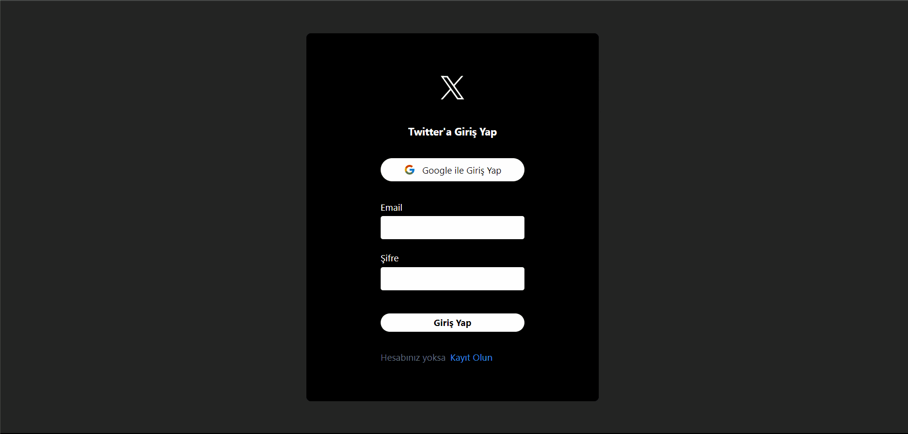

# Twitter Clone with React and Firebase

Bu proje, React ve Firebase kullanılarak oluşturulmuş basit bir Twitter klonudur. Kullanıcılar, tweet oluşturabilir, tweetleri görüntüleyebilir ve Firebase üzerinden gerçek zamanlı olarak veri senkronizasyonunu deneyimleyebilirler.

## Kullanılan Teknolojiler ve Kütüphaneler

Bu proje, aşağıdaki ana teknolojiler ve kütüphaneler kullanılarak geliştirilmiştir:

- **React**: Modern bir JavaScript kütüphanesi.
- **Firebase**: Gerçek zamanlı veritabanı ve kimlik doğrulama sağlayan platform.
- **react-router-dom**: React uygulamaları için yönlendirme işlevselliği sağlar.
- **react-toastify**: Kullanıcıya bildirimler göstermek için kullanılan küçük bir bildirim kütüphanesi.
- **react-icons**: Popüler ikon kütüphanesi.
- **moment**: Tarih ve saatleri işlemek için kullanılan bir kütüphane.
- **uuid**: Benzersiz kimlikler oluşturmak için kullanılan kütüphane.
- **tailwind CSS**: Hızlı ve kolay bir şekilde özelleştirilebilir CSS bileşenleri oluşturmak için kullanılan CSS çerçevesi.

## Özellikler

- Kullanıcılar tweet oluşturabilir, düzenleyebilir like atabilir ve silebilir.
- Gerçek zamanlı olarak tweet güncellemelerini görüntüleme.
- Kullanıcı dostu arayüz tasarımı.

## Yaınlanmış proje adresi;

https://twitter-clone-firebase-alpha.vercel.app/
